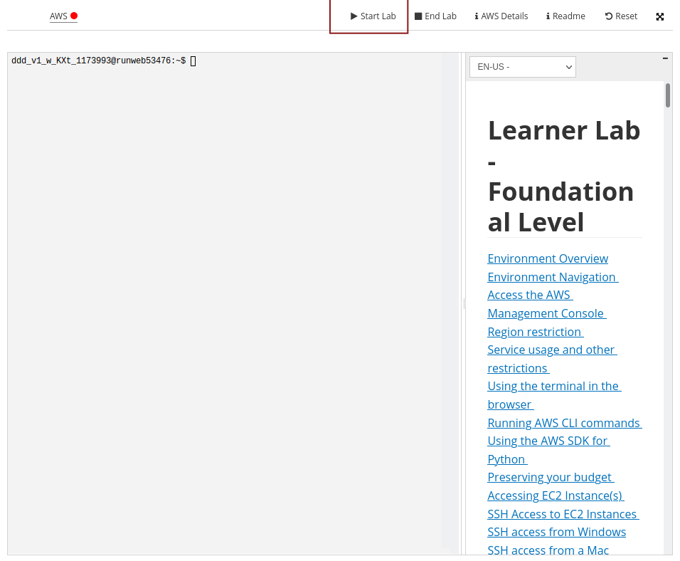

[](https://classroom.github.com/a/fFgr-qE8)
[](https://classroom.github.com/online_ide?assignment_repo_id=10899928&assignment_repo_type=AssignmentRepo)
Compsci 677: Distributed and Operating Systems

Spring 2023

# Lablet 5: Cloud Computing

The purpose of this homework is to provide hands-on experience with cloud computing using Amazon Web Services.


## Running a virtual machine on AWS 

In this part you will get hands-on experience with AWS Elastic Compute Cloud (EC2, which is the IaaS
offering for AWS). You will learn how to configure AWS CLI, how to create an EC2 instance, how to
connect to an EC2 instance, how to clean up EC2 resources, etc. **Please take note of the time you
spend in every operation because at the end of this part you need to estimate the cost of all the
operations in this AWS homework**.

> Note: For students using Windows, please run all the commands in this homework in Git Bash.

### Install AWS CLI

AWS CLI is a command line interface for managing AWS services including EC2. It supports all major
platforms (Linux, macOS, and Windows). You can follow the instructions
[here](https://docs.aws.amazon.com/cli/latest/userguide/getting-started-install.html) to install AWS
CLI on your machine. To verify your installation, open a terminal and run `aws --version`. The
output should start with something like `aws-cli/2.5.6`. If the `aws` command cannot be found, you
may need to restart your terminal or follow the instructions
[here](https://docs.aws.amazon.com/cli/latest/userguide/getting-started-path.html) to add the AWS
CLI to your `PATH`.

### Obtain AWS Credentials

We will be adding all the students to a class on AWS Academy, and each student will get their own
credentials through AWS Academy. You should soon receive a course invitation email from AWS Academy
that looks like this:


Click "Get Started" and follow the instructions to create a Canvas Account. If you already have a
Canvas account (e.g., if you have used AWS Academy in another class) you should login using your
existing account.

After logging in to your account, click "Modules" then "Learner Lab - Foundational Services".


Now you will be greeted with the terms and conditions, read them if you want then click "I agree".
Now you should see the following page. Click the "Start Lab" button. It may take several minutes to
start the AWS environment.



> Note: A lab session is limited to 4 hours so please plan your time ahead.

After the lab has been started, click the "AWS Details" button. On the right side panel there will
be a "Show" button following AWS CLI, click on that. The code that appeared in the textbox below
contains the credentials that the AWS CLI uses to interact with AWS. Copy the code and save it to
`$HOME/.aws/credentials` on Linux/macOS or `%USERPROFILE%/.aws/credentials` (The value of
`%USERPROFILE%` usually is `c:\Users\username`) on Windows.


> Note: Every time you start the lab AWS Academy will generate new credentials for you. Therefore if
> you end a lab and then start a new lab, you should delete you previous credentials file and create
> a new one using your new credentials.

There will also be a "Download PEM" button following SSH key, click on that. Save the PEM key file
to your working directory.

### Configure Your AWS Settings

Next we need to configure and the default AWS Region where AWS resources (including EC2 instances)
will be deployed, and the default output format of AWS CLI commands. and run `aws configure`, then
follow the steps below:

1. It will ask your AWS Access Key ID, we have already configured that in the previous step by
   creating a credentials file. Just press enter to skip this step.
2. It will ask your AWS Secret Access Key, we have also configured that in the previous step. Press
   enter to skip this step.
3. For default region name, be sure to input `us-east-1`. Otherwise the PEM key we just downloaded
   won't work!
4. For default output format, input `json`.

If you made a mistake in step 1 or 2, go back to the AWS Academy webpage, copy the credentials and
save it to `$HOME/.aws/credentials` on Linux/macOS or `%USERPROFILE%/.aws/credentials` on Windows.
If you made a mistake in step 3 or 4, just run `aws configure` again and input the correct value.

### Start Your First EC2 Instance

You will now create and run an EC2 Instance, which is another name for a virtual machine that runs on AWS servers. 
When creating an EC2 instance, two of the most important settings to consider are 1) what instance
type to use (this determines how much resources are allocated to your instance, as well as cost you
will be paying), and 2) what image to use (this determines what operating system will running inside
your instance).

Here we will use the `t2.micro` instance type as it is one of the cheapest instance types available
on AWS. For image id we will be using the Ubuntu 18.04 server image provided by Canonical, at the
time of writing the latest AMI (Amazon Machine Images) ID is `ami-0d73480446600f555`. If you are
curious, you can also find the AMD IDs of other Ubuntu versions here:
https://cloud-images.ubuntu.com/locator/ec2/ (be sure to select the correct region and arch).

Now we can create our first EC2 instance using AWS CLI. Open a terminal and run

```shell
aws ec2 run-instances --image-id ami-0d73480446600f555 --instance-type t2.micro --key-name vockey > instance.json
```

The `instance.json` file will contain the details of your instance. Copy the `InstanceId` field. Now
in your terminal check the status of your instance using the following command:

```shell
aws ec2 describe-instances --instance-id <your-instance-id>
```

This gives various details about the instance type, who is running it, and the public DNS name where
you can access the instance, something like

```
ec2-54-85-216-54.compute-1.amazonaws.com
```

Record the approximate time it took to create the instance (seconds? minutes?)

### Access Your EC2 instance via SSH

Before running ssh command there are two things we need to do. The first is to set the right
permission for the PEM key.

```shell
chmod 400 labuser.pem
```

The other thing we need to do is to authorize port 22 (used by ssh) in the default security group
(you can think of security group as a virtual firewall).

```shell
# allows ssh access from anywhere
aws ec2 authorize-security-group-ingress --group-name default --protocol tcp --port 22 --cidr 0.0.0.0/0
```

> Note: If you get an `InvalidPermission.Duplicate` error that means ssh has already been enabled in
> your security group. You can simply ignore this error

Now that everything is ready, we can connect to our instance via ssh:

```shell
ssh -i labsuser.pem ubuntu@<your-instance's-public-DNS-name>
```

ssh may ask you about the instance key fingerprint, if so just input yes. Now you should get a shell
to your EC2 instance and your can manage your instance from there.

### Install Softwares

You can instal softwares on EC2 instances just like on any other linux machines:

```shell
sudo apt update && sudo apt install -y emacs
```

### Create a New Image from a Running Instance

Now we can take our customized server and create a new machine image based on its disk state. This
will allow us to create a new future instance with these customized applications preinstalled.

On your local terminal, use the `create-image` command and give it the instance-id and a name for
your new image.

```shell
aws ec2 create-image --instance-id <your-instance-id> --name 677_test_image
```

If successful, this returns a new AMI, note down this ami-id. Check if the AMI has been registered:

```shell
aws ec2 describe-images --image-ids <your-new-ami-id>
```
> **WARINING:** When you execute the previous command, you will get a response with a field named "State". While the image is being created, the value of this field will be pending. Give it a few minutes until you see it change to "available" before you continue to the next step. 


### Create an Instance Using This New Image

You can now terminate your old instance since we have already created a machine image with our
changes.

```shell
aws ec2 terminate-instances --instance-ids <your-instance-id>
```

You can approximate the time it takes to terminate by looking at the output and see the status of
your instance (running/shutting-down/stopped/terminated, etc). Now you can start another instance
from your customized AMI!

```shell
aws ec2 run-instances --image-id <your-new-ami-id> --instance-type t2.micro --key-name vockey > instance.json
```

Note that the instance id of this newly created instance is different. You can ssh into this new
instance to verify that emacs has already been installed. After that terminate the instance using
the `ec2-terminate-instances` command as before.

### Estimate the Cost of All Operations in This AWS homework

Use [Amazon’s pricing policy](https://aws.amazon.com/ec2/pricing/) to compute the cost of all
operations you performed in this assignment. Note which instances you used and for how much time.
Then search how much they cost per unit of time (On Demand pricing) and estimate how much you have
spent in total. Factor in storage costs: unless your instance has local storage, its filesystem will
be stored by an external storage system (EBS) that incurs a cost even if the instance is off. Then
consider other costs such as out of network data transfers, S3 operations, etc.

### Cleaning up

Be sure to terminate your instances. Note that Amazon gives each student a certain amount of credits
and if you do not terminate your cloud servers, they will continue to incur usage changes and use up
your entire usage limit.

You also need to deregister you newly created AMI by

```shell
aws ec2 deregister-image --image-id <your-ne-ami-id>
```

Deregistering an AMI does not actually delete it, you need to delete the snapshot associated with
the AMI. First find the snapshot by

```shell
aws ec2 describe-snapshots --owner-ids self
```

Note down the snapshot ID from the command output, then you can delete the snapshot using

```shell
aws ec2 delete-snapshot --snapshot-id <your-snapshot-id>
```

Finally, go back to the AWS Academy webpage and click the "End Lab" button to end you lab session.


## What to submit

Please turn in a short (1-2 page) report with your observations and output from the key steps in
this assignment. Please include the following information.

Answer all the questions listed in the description of the steps.

  * How long did it take to create an EC2 instance?
  * Provide an estimate (approximate estimates are OK) on how much your EC2 operations will cost.
    Use Amazon’s pricing policy and monitoring data to compute your estimates.
  * Clearly mention which EC2 api commands you tried, and All the AMI and instance IDs that you
    created.
